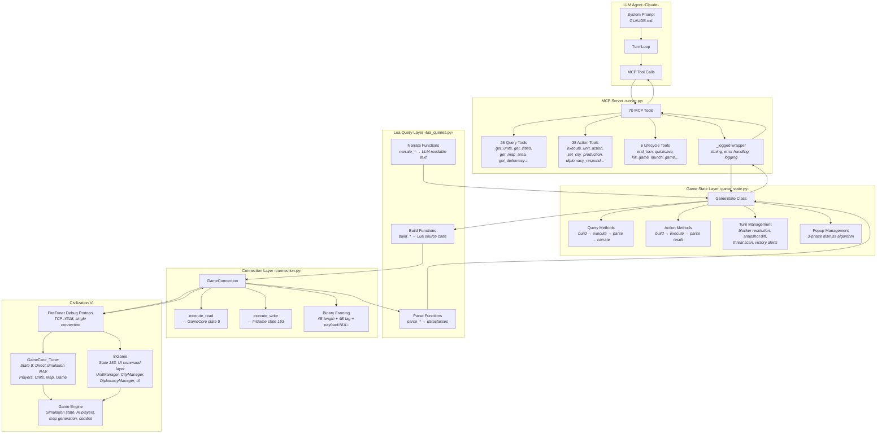
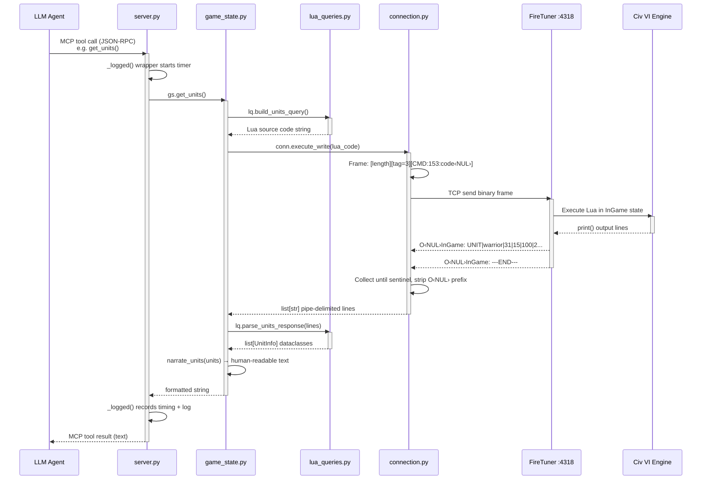
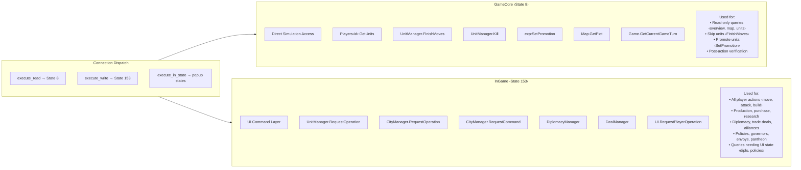
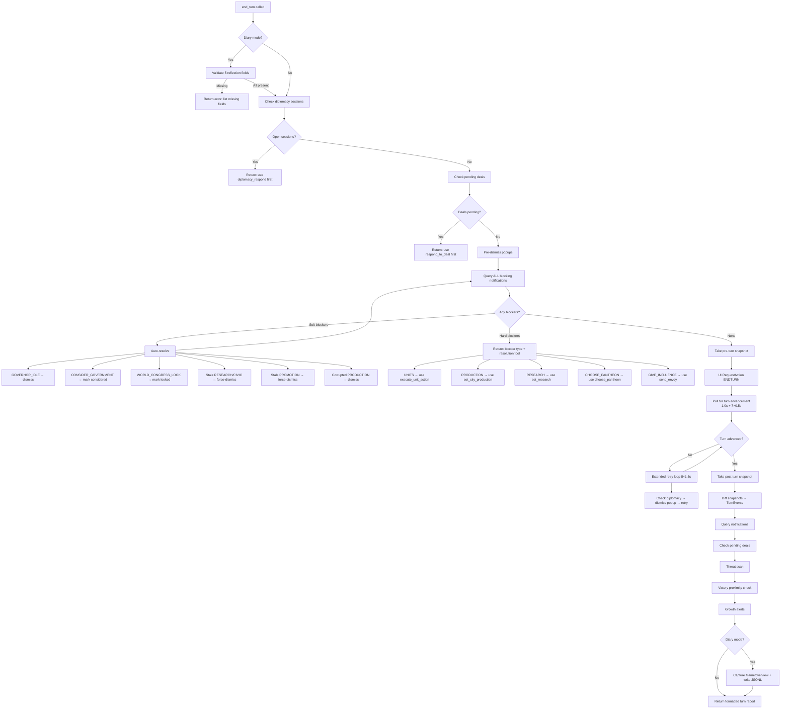
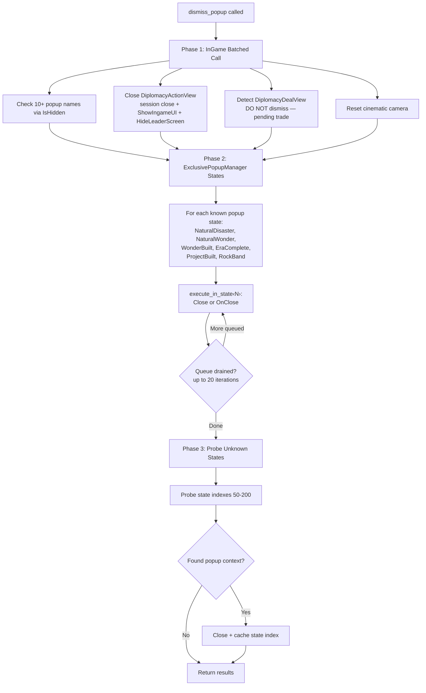

> 本文件是 `architecture-diagrams.md` 的中文备份（由英文文件翻译而来，供人阅读）：DSH 只读英文文件，请勿在此修改。

# CivBench 系统架构

本文件说明一个 LLM 智能体如何通过 civ6-mcp 服务器玩《文明 VI》。它覆盖了从工具调用到游戏引擎再返回的完整技术栈、游戏内部的两个 Lua 执行上下文，以及最困难的工程问题：回合推进、弹窗管理与异步操作。

假定读者熟悉《文明 VI》的玩法，但不了解游戏的内部机制。

---

## 各部件如何组合在一起

系统有五层。智能体（例如 Claude 这样的 LLM）通过 Model Context Protocol 发起工具调用。MCP 服务器把这些调用转换成对 GameState 对象的方法调用。GameState 构造 Lua 源代码，通过 TCP 发送到游戏的 FireTuner 调试接口，解析以竖线分隔的输出，并把人类可读的文本返回给智能体。



关键的洞见是：**智能体永远看不到像素**。它对游戏的一切了解都来自工具调用返回的文本。一位人类玩家每秒被动接收数十种信号 —— 小地图、得分滚动条、单位血条、迷雾边界。智能体必须逐个显式查询。这就是论文中描述的*感官效应*，而它是这套技术栈的一个架构属性，不是模型的局限。

---

## 为信息对等而设计

一位看着《文明 VI》屏幕的人类玩家，无需索取就会收到密集的视觉信息流：小地图显示迷雾边界与领土；得分横幅不断跳动；城市的增长条逐渐填满；一个敌方单位出现在可见范围的边缘。工具套件被刻意设计为：为人类玩家所依赖的**每一种视觉可供性提供文本等价物**，从而使人与智能体之间的信息不对等只是一个*轮询纪律*问题，而不是*能力缺失*问题。

下表把人类的每一种视觉可供性映射到其工具等价物：

| 人类看到 | 智能体调用 | 返回内容 |
|-----------|-------------|-----------------|
| 覆盖地图的战争迷雾 | `get_game_overview` | `exploration_pct: 32%` —— 一个单一数字，概括地图已被揭示的比例，等同于瞄一眼还剩多少迷雾 |
| 角落的小地图 | `get_minimap` | 带符号的 ASCII 网格：`O`=己方城市，`X`=敌方城市，`~`=水域，`^`=山脉，`*`=战略资源。一眼看出地图形状、领土与迷雾边界 |
| 战略视图叠加层 | `get_strategic_map` | 每座城市的迷雾边界（各个基本方向上已探索的格子）以及领土之外的无主资源 |
| 屏幕上的六边形格子及其地形、资源、单位 | `get_map_area` | 在某个半径内逐格分解：地形类型、地貌要素、资源、改良设施、归属、产出，以及任何可见单位并带有加粗的威胁标记，如 `**[Barbarian WARRIOR CS:20]**` |
| 城市横幅（名称、人口、生产、增长条） | `get_cities` | 人口、食物盈余、距增长回合数、当前生产及其剩余回合数、忠诚度、宜居度、住房。包含饥荒与停滞警告 |
| 屏幕顶部的得分滚动条 | `get_game_overview` | 总分、各玩家排名、产出速率（科技、文化、金币、信仰）、时代得分与阈值对比 |
| 外交界面（领袖态度、修正项） | `get_diplomacy` | 各文明的关系状态、带解释的数值修正项（"+3: Delegation"、"-6: Different Government"）、军力对比、可用外交行动 |
| 悬停在攻击上时弹出的战斗预览 | `attack` 动作 | 战前估算：战斗力、所有修正项（地形、设防、侧翼攻击）、双方预期伤害、击杀概率 —— 在投入攻击*之前*运行 |
| 显示逐城皈依情况的宗教透镜 | `get_religion_status` | 每座可见城市的主流宗教、各宗教的信徒数量、压力来源 |
| 胜利进度界面 | `get_victory_progress` | 各文明在全部 6 种胜利类型上的进度，附可行性评分（0-100%）与建议的战略转向 |
| 贸易路线总览界面 | `get_trade_routes` | 容量与在用路线对比、各路线产出、商人位置、空闲商人检测 |
| 伟人招募界面 | `get_great_people` | 可选候选人、招募成本、当前点数与竞争者对比、伟人能力 |
| 区域选址透镜 | `get_district_advisor` | 按相邻加成排序的合法格子，并分解每项加成的来源 |
| 通知面板（屏幕右侧） | `end_turn` 返回值 | AI 回合期间发生的事件：单位被击杀、受到的伤害、增长的城市、完成的生产、新的遭遇。另有威胁扫描与胜利临近警报 |

其中有几项值得特别关注：

**探索百分比**是被压缩得最厉害的视觉可供性。人类玩家看到小地图上大约 70% 被迷雾覆盖，会凭直觉知道“我探索得还不够”。智能体拿到的是一个单一数字 —— `exploration_pct: 32%` —— 它起到同样的作用。系统提示词定义了基准（T50 时 25%，T100 时 50%），把这个数字转换成紧迫感，就像人类把视觉上的迷雾覆盖转换成“我该再造一个侦察兵”一样。

**战斗估算器**复刻了人类把鼠标悬停在攻击目标上时出现的预览弹窗。它计算带有全部修正项（地形防御、设防、侧翼攻击、晋升）的战斗力，使用游戏的战斗公式估算双方的伤害，并报告击杀概率。智能体在投入*之前*就能看到这些，正如人类一样 —— 区别在于人类是靠悬停鼠标看到，而智能体是在攻击动作的预检部分拿到。

**回合事件差异比较**解决了最困难的对等问题：回合之间发生了什么。人类会看着 AI 单位移动、看到战斗动画、在城市增长时听到通知音。智能体完全得不到这些。取而代之，服务器在回合前后各拍一份快照，计算增量并报告："Your Warrior at (36,32) took 15 damage. Delhi completed Monument. Babylon founded a new city." 这比人类得到的信息要少（除了视野内的内容，无法看到 AI 单位的移动），但它捕捉到了关键的状态变化。

**主动警报**填补了一部分轮询缺口。即便智能体忘了检查胜利进度，`end_turn` 也会每回合运行一次胜利临近扫描，并在任何对手接近胜利时发出警告。增长警报会标记停滞的城市。威胁扫描会报告你边界附近的敌方单位。这些是游戏通知面板在工具侧的等价物 —— 信息被推送给智能体，而不是要求它主动查询。

剩下的缺口是结构性的，而不是信息性的：这些工具确实存在，但智能体必须*选择去调用它们*。人类玩家的眼睛始终睁着；智能体的感知是间歇性的，被回合循环内的工具调用所门控。系统提示词规定了轮询节奏（每 20 回合检查一次外交、每 20 回合检查一次胜利进度、每 30 回合检查一次战略地图），但能否遵守取决于智能体的纪律 —— 这就是感官效应。

---

## 70 个工具

工具分为三类：

**查询工具**（26 个）是只读的。它们问游戏“状态是什么？”，并返回结构化文本。例如：`get_units` 返回每个单位的位置、HP 和可用动作；`get_map_area` 返回一个半径内的六边形格子及其地形、资源和任何可见单位；`get_diplomacy` 返回每个已知文明的关系状态、修正项和可用外交行动。

**动作工具**（38 个）会改变游戏状态。它们对应人类玩家会点击的事情：移动单位、设置生产、宣布友好、提议一笔贸易交易。每个动作工具在执行前都会校验前置条件（该单位能到达那个格子吗？该城市有这个建筑可用吗？该外交行动合法吗？），并返回带确认的 `OK:` 或带原因的 `ERR:`。

**生命周期工具**（6 个）管理游戏会话本身：推进回合、存档/读档，以及崩溃恢复（杀掉进程、通过 Steam 重新启动、使用基于 OCR 的菜单导航重新载入存档）。

---

## 一次工具调用的剖析

当智能体调用 `get_units` 这样的工具时，完整的旅程如下：



每个查询都遵循这同一个四步模式：

1. **构造**：`lua_queries.py` 生成一个 Lua 源代码字符串。Lua 使用 `print()` 输出以竖线分隔的字段（例如 `print("WARRIOR|31|15|100|2")`），并以 `print("---END---")` 作为哨兵结尾。

2. **执行**：`connection.py` 把 Lua 包装进一个二进制帧 —— 4 字节小端长度、4 字节标签（3 = 命令），以及以空字符结尾的载荷 `CMD:153:lua_code` —— 然后通过 TCP 发送到端口 4318。游戏执行该 Lua，并回流传以 `O\0InGame:` 为前缀的输出行。连接层持续收集行，直到看见 `---END---` 哨兵。

3. **解析**：`lua_queries.py` 把每一行以竖线分隔的内容拆成字段，并返回结构化的 Python 数据类（`UnitInfo`、`CityInfo`、`TileInfo` 等）。

4. **叙述**：`game_state.py` 把数据类转换成面向 LLM 消费而优化的人类可读文本。正是在这里，`UNIT_WARRIOR|31|15|100|2|FORTIFIED` 这样的原始数据变成了 `Warrior #65536 at (31,15) HP:100/100 moves:2 [FORTIFIED]`。

动作工具遵循同样的模式，但跳过叙述 —— 它们返回简短的 `OK: moved to (32,15)` 或 `ERR:STACKING_CONFLICT` 结果。

---

## 线路协议

《文明 VI》自带一个名为 FireTuner 的内置调试接口。它是一个监听端口 4318 的 TCP 服务器，同一时间只接受**单个连接**。线路格式很简单：

| 字段 | 大小 | 说明 |
|-------|------|-------------|
| 长度 | 4 字节 LE uint32 | 消息总长度（不含本字段） |
| 标签 | 4 字节 LE int32 | 消息类型：4=握手，3=命令，1=帮助 |
| 载荷 | 可变长度，以空字符结尾 | 对于命令：`CMD:state_index:lua_code` |

连接时，服务器会进行一次握手交换。我们的客户端发送 `APP:civ6-mcp`，游戏以 `LSQ:` 回应，其后交替给出 state 索引数字与名称的行。这告诉我们有哪些可用的 Lua 上下文 —— 关键的是 `GameCore_Tuner` 和 `InGame` 的索引。

Lua `print()` 调用的输出以 `O\0context_name: value` 的形式返回 —— `O` 与上下文名称之间是一个字面量空字节。连接层剥掉这个前缀，并持续收集行，直到看见每个查询都会追加的 `---END---` 哨兵。

单连接约束在架构上很重要：它意味着多智能体配置（例如把军事和经济拆成不同的子智能体）必须通过单一 TCP 连接串行化，而不能并行查询游戏。

---

## 两个 Lua 世界

这是理解游戏内部机制最重要的一点。《文明 VI》暴露了**两个彼此分离的 Lua 执行上下文**，它们的 API 不同、语义也不同：



*注意：显示的 state 索引（8 和 153）来自 macOS。在 Windows 和 Linux 上它们不同（例如 4 和 125）。连接层在握手期间发现正确的索引 —— 你永远不需要硬编码它们。*

**GameCore（state 8）** 是对模拟的直接访问。你可以读取任何东西 —— 单位位置、城市产出、地图地形、科技进度 —— 也可以直接写入一些东西（击杀单位、设置晋升、结束单位的移动）。它是“上帝模式”视角。但它绕过了游戏的规则校验层：如果你在这里调用 `UnitManager.FinishMoves()`，游戏会直接执行，而不检查该动作是否合法。

**InGame（state 153）** 是 UI 命令层 —— 游戏自己的 Lua UI 代码在你点击按钮时用的就是它。`UnitManager.RequestOperation()` 会检查单位是否真的能移动到那里（寻路、堆叠规则、移动力）。`CityManager.RequestOperation()` 会检查城市是否真的能生产该物品。`DiplomacyManager` 处理外交行动的完整会话协议。一切都经过游戏的校验流水线，就像人类的一次点击一样。

连接层提供三种分派方法：
- `execute_read()` → 总是发往 GameCore（state 8），用于查询
- `execute_write()` → 总是发往 InGame（state 153），用于动作
- `execute_in_state(N)` → 按索引定位某个特定 state，用于关闭弹窗

**为什么两者都需要**：你可能会想“干脆全都用 InGame” —— 但有好几个 InGame API 是坏的或缺失的。`UnitOperationTypes.SKIP_TURN` 在 InGame 中是 `nil`。`RequestCommand(PROMOTE)` 会静默失败。有些查询（外交修正项、政策槽位、总督状态）只存在于 InGame。有些操作（结束单位的移动、设置晋升）只有在 GameCore 中才可靠。代码库为每个操作选用真正可用的那个上下文，这是通过大量试错发现的。

**一个关键的坑：`.Hash` 与 `.Index`**。大多数游戏数据库查找（单位、建筑、政策）使用 `.Hash` —— 一个稳定的整数标识符。但总督和晋升使用 `.Index` —— 一个顺序整数。在期望 Index 的地方传 Hash，会让游戏的 C++ 层因越界错误而崩溃。这一区别在游戏的源码中没有任何文档记载。

---

## 动作如何工作

当智能体移动一个单位时，生成的 Lua 代码大致如下：

```lua
local me = Game.GetLocalPlayer()
local unit = UnitManager.GetUnit(me, 42)        -- get unit by index
if not unit then print("ERR:UNIT_NOT_FOUND"); print("---END---"); return end

-- Check if the target tile has a stacking conflict
local plot = Map.GetPlot(32, 15)
for u in Map.GetUnitsAt(32, 15):Units() do
    if u:GetOwner() == me and u:GetFormationClass() == unit:GetFormationClass() then
        print("ERR:STACKING_CONFLICT"); print("---END---"); return
    end
end

-- Build params and check if the operation is valid
local params = { [UnitOperationTypes.PARAM_X] = 32, [UnitOperationTypes.PARAM_Y] = 15 }
if not UnitManager.CanStartOperation(unit, UnitOperationTypes.MOVE_TO, nil, params) then
    print("ERR:CANNOT_MOVE"); print("---END---"); return
end

-- Execute
UnitManager.RequestOperation(unit, UnitOperationTypes.MOVE_TO, params)
print("OK:MOVED|32|15")
print("---END---")
```

每个动作都遵循这个模式：查找实体、校验前置条件、执行、报告结果。`lua_queries.py` 中的 `_bail()` 辅助函数生成 `print("ERR:...")/print("---END---")/return` 错误模式，使失败总能被干净地报告回智能体。

**异步操作**：`RequestOperation` 不会立即完成。移动单位会把寻路排入队列 —— 单位位置在下一帧更新。建立城市会在下一帧创建该城市。移动的响应告诉你的是*目标*，而不是单位的实际位置。对于建立城市这类关键操作，代码会再对 GameCore 做一次往返以确认动作已生效。

---

## 结束回合机器

`end_turn` 是迄今为止最复杂的操作。在人类游玩时，你按下“结束回合”，游戏要么推进，要么告诉你为什么不能推进（未移动的单位、未设置的生产等）。对智能体而言，这要求以编程方式检测并解决每一种可能的阻塞。



该流程分为三个阶段：

### 阶段 1：清除障碍

在尝试推进回合之前，服务器先检查会阻塞推进的事项。外交会话（某个 AI 文明想跟你对话）和待处理的贸易交易必须由智能体处理 —— 服务器会返回一条消息，告诉它该用哪个工具。弹窗（奇观建成、自然灾害通知、时代更替）会被自动关闭。

然后它一次性查询*所有*阻塞性通知。有些是“软”阻塞 —— 服务器无需智能体输入即可自动解决。有可用的总督点数但智能体还没分配？关闭该通知。游戏想让你考虑更换政体？把它标记为已考虑。某条研究通知是陈旧的，因为该科技已经通过 GameCore 设置过了？强制关闭它。这些软阻塞在一个循环中解决（最多 3 次迭代，因为解决一个可能会暴露出另一个）。

“硬”阻塞则需要智能体做出决定：移动哪个单位、生产什么、研究哪项科技、选择哪个万神殿、向哪个城邦派遣使者。服务器返回阻塞类型，并告诉智能体该用哪个工具。

### 阶段 2：推进回合

一旦所有阻塞都清除，服务器就对当前游戏状态拍一份快照（单位位置、城市生产、研究进度），然后触发 `UI.RequestAction(ActionTypes.ACTION_ENDTURN)`。这是异步的 —— AI 玩家需要时间来走它们的回合。

服务器轮询回合是否推进：先等 1 秒，然后最多进行 7 次、每次间隔 0.5 秒的检查。如果回合仍未推进（在 AI 玩家触发外交遭遇、或游戏在 AI 回合中显示弹窗通知时很常见），它进入扩展重试循环 —— 检查新的外交会话、关闭弹窗，并最多再发送 5 次结束回合动作。

### 阶段 3：报告发生了什么

回合推进后，服务器拍第二份快照，并与第一份做差异比较。这会产生一组 `TurnEvent` 对象：死亡的单位、受到伤害的单位、增长的城市、完成的生产、完成的科技。它还会查询新出现的通知（新的遭遇、新的阻塞），扫描我们城市附近的可见敌方单位，检查是否有文明接近胜利，并标记增长停滞的城市。

如果启用了日记模式，它会捕获一份 `GameOverview` 快照（得分、产出、时代得分），并写入一条 JSONL 记录，把得分数据与智能体的五个反思字段（tactical、strategic、tooling、planning、hypothesis）合在一起。

所有这些都作为单个格式化文本块返回 —— 即智能体的“AI 回合期间发生了什么”简报。

---

## 弹窗问题

《文明 VI》的 UI 是为人类点击屏幕而设计的，不是为程序化控制而设计的。游戏使用一个 `ExclusivePopupManager`，一次显示一个模态弹窗 —— 奇观建成、自然灾害、时代完成、摇滚乐队演出。每个弹窗都会**锁住游戏引擎**，直到它被关闭。如果有弹窗在显示，单位操作会静默失败，回合推进也会静默失败，而且没有任何错误信息告诉你原因。

关闭算法有三个阶段，因为没有单一方法能处理所有弹窗类型：



**阶段 1** 使用 InGame 上下文处理通用弹窗和外交界面。它用 `IsHidden()` 检查可见性，并调用 `SetHide(true)` 或触发关闭处理函数。外交界面需要特别小心：3D 领袖模型由 C++ 引擎渲染，所以只关闭 Lua UI 是不够的 —— 你还必须调用 `Events.HideLeaderScreen()` 来卸载 3D 视口，并调用 `LuaEvents.DiplomacyActionView_ShowIngameUI()` 来恢复 HUD。有一条关键规则：`DiplomacyDealView`（收到的贸易提议）绝不能关闭 —— 那会在智能体没看到的情况下拒绝该交易。

**阶段 2** 处理 `ExclusivePopupManager` 弹窗。它们运行在自己的 Lua state 中（不是 InGame），因此需要 `execute_in_state(N)` 才能触达。每个都有一个 `Close()` 或 `OnClose()` 函数来释放引擎锁。队列可能堆积（例如同一回合建成两个奇观），所以代码以最多 20 次迭代的循环逐个清空每个弹窗 state。

**阶段 3** 是针对初次握手时未被发现的弹窗 state 的兜底。代码探测 50-200 的 state 索引，寻找带有 `Close` 函数的上下文。任何被发现的 state 都会缓存起来供后续调用使用。

---

## 叙述：为 LLM 翻译数据

一个微妙但重要的设计选择：MCP 工具不返回原始数据，而是返回**叙述性文本** —— 为 LLM 消费而优化的类散文描述。

原始解析输出可能是一个 `UnitInfo(type_name="UNIT_WARRIOR", x=31, y=15, hp=100, max_hp=100, moves=2, max_moves=2, status="FORTIFIED")`。叙述层把它变成：

```
Warrior #65536 at (31,15) HP:100/100 moves:2/2 [FORTIFIED]
  Actions: skip, heal, alert, sleep, delete, move, attack
```

对于地图格子：
```
(31,15) Grassland Hills [RIVER] — Farm — owned by player 0
  Yields: 3🌾 1⚙️
  **[Barbarian WARRIOR CS:20]**
```

这一点很重要，因为智能体处理的是文本，不是结构化数据。让威胁在视觉上突出（敌方单位用加粗标记）、包含动作提示（哪些工具解决哪些阻塞）、以及用 emoji 图标格式化产出，都能降低模型的认知负担。叙述层正是“原始游戏 API 输出”变成“智能体可以据以行动的信息”的地方。

---

## 关键设计约束

**单线程串行化。** 一个 TCP 连接，同一时间只执行一个 Lua。每次工具调用都是一次同步往返。在一局 300 回合、每回合约 30 次工具调用的游戏中，那就是约 9,000 次串行往返。每次调用的延迟通常是：查询 50-200ms，动作 200-500ms，结束回合 2-10 秒（等待 AI 玩家）。

**不修改游戏。** 服务器只使用原版 FireTuner 协议。没有 MOD，没有 DLL 注入，没有内存修改。这意味着我们受限于游戏 Lua 层所暴露的 API —— 而它暴露的一些东西是坏的（跳过回合、晋升单位、某些通知类型），需要通过另一个 Lua 上下文来绕过。

**无状态的工具调用。** 每次 MCP 工具调用都是独立的 —— 服务器不在调用之间维护“计划”或“策略”。所有战略连续性都存在于智能体的上下文窗口中（启用日记模式时，还存在于 JSONL 文件中）。这是一个刻意的设计选择：服务器是基础设施，不是智能。

**游戏规则得到强制执行。** 每个动作在执行前都经过游戏自身的校验。智能体无法作弊 —— 它不能让单位移动超过移动力允许的距离，不能建造城市无法生产的东西，也不能在友好关系期间宣战。FireTuner 接口是一个调试工具，但 MCP 服务器对所有玩家动作都只通过遵守规则的 InGame 命令层来使用它。
